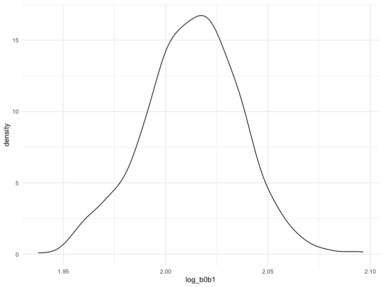
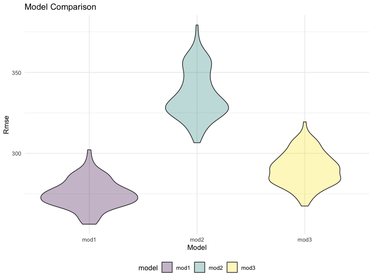

p8105_hw6_jt3387
================

## Problem 1

To obtain a distribution for $\hat{r}^2$, we’ll follow basically the
same procedure we used for regression coefficients: draw bootstrap
samples; the a model to each; extract the value I’m concerned with; and
summarize. Here, we’ll use `modelr::bootstrap` to draw the samples and
`broom::glance` to produce `r.squared` values.

``` r
weather_df = 
  rnoaa::meteo_pull_monitors(
    c("USW00094728"),
    var = c("PRCP", "TMIN", "TMAX"), 
    date_min = "2017-01-01",
    date_max = "2017-12-31") %>%
  mutate(
    name = recode(id, USW00094728 = "CentralPark_NY"),
    tmin = tmin / 10,
    tmax = tmax / 10) %>%
  select(name, id, everything())
```

    ## Registered S3 method overwritten by 'hoardr':
    ##   method           from
    ##   print.cache_info httr

    ## using cached file: ~/Library/Caches/R/noaa_ghcnd/USW00094728.dly

    ## date created (size, mb): 2022-09-06 10:44:02 (8.397)

    ## file min/max dates: 1869-01-01 / 2022-09-30

``` r
weather_df %>% 
  modelr::bootstrap(n = 1000) %>% 
  mutate(
    models = map(strap, ~lm(tmax ~ tmin, data = .x) ),
    results = map(models, broom::glance)) %>% 
  select(-strap, -models) %>% 
  unnest(results) %>% 
  ggplot(aes(x = r.squared)) + geom_density()
```


In this example, the $\hat{r}^2$ value is high, and the upper bound at 1
may be a cause for the generally skewed shape of the distribution. If we
wanted to construct a confidence interval for $R^2$, we could take the
2.5% and 97.5% quantiles of the estimates across bootstrap samples.
However, because the shape isn’t symmetric, using the mean +/- 1.96
times the standard error probably wouldn’t work well.

We can produce a distribution for $\log(\beta_0 * \beta1)$ using a
similar approach, with a bit more wrangling before we make our plot.

``` r
weather_df %>% 
  modelr::bootstrap(n = 1000) %>% 
  mutate(
    models = map(strap, ~lm(tmax ~ tmin, data = .x) ),
    results = map(models, broom::tidy)) %>% 
  select(-strap, -models) %>% 
  unnest(results) %>% 
  select(id = `.id`, term, estimate) %>% 
  pivot_wider(
    names_from = term, 
    values_from = estimate) %>% 
  rename(beta0 = `(Intercept)`, beta1 = tmin) %>% 
  mutate(log_b0b1 = log(beta0 * beta1)) %>% 
  ggplot(aes(x = log_b0b1)) + geom_density()
```



As with $r^2$, this distribution is somewhat skewed and has some
outliers.

The point of this is not to say you should always use the bootstrap –
it’s possible to establish “large sample” distributions for strange
parameters / values / summaries in a lot of cases, and those are great
to have. But it is helpful to know that there’s a way to do inference
even in tough cases.

## Problem 2

Load and clean the data set.

``` r
raw_data <- read.csv("https://raw.githubusercontent.com/washingtonpost/data-homicides/master/homicide-data.csv")
homicide <- raw_data %>% 
  janitor::clean_names() %>%
  mutate(city_state = str_c(city, state, sep = ", "),
         resolution = if_else(disposition == "Closed by arrest", 1, 0),
         victim_age = as.numeric(victim_age)) %>% 
  filter(!city_state %in% c("Dallas, TX", "Phoenix, AZ", "Kansas City, MO", "Tulsa, AL"),
         victim_race %in% c("White", "Black"))
```

Fit a logistic regression model for city of Baltimore, MD.

``` r
baltimore_df = homicide %>%
  filter(city_state == "Baltimore, MD")

baltimore_glm = 
  glm(resolution ~ victim_age + victim_sex + victim_race, family = binomial, data = baltimore_df) %>%
  broom::tidy() %>% 
  mutate(OR = exp(estimate),
         CI_lower = exp(estimate - 1.96 * std.error),
         CI_upper = exp(estimate + 1.96 * std.error)) %>%
  filter(term == "victim_sexMale") %>%
  select(term, OR, CI_lower, CI_upper)

baltimore_glm %>% 
  knitr::kable(digits = 3)
```

| term           |    OR | CI_lower | CI_upper |
|:---------------|------:|---------:|---------:|
| victim_sexMale | 0.426 |    0.325 |    0.558 |

-   The estimate value of the adjusted odds ratio is 0.426, the
    confidence interval is (0.325, 0.558).

Run glm for each of the cities.

``` r
all_city_glm = homicide %>% 
  nest(data = -city_state) %>% 
  mutate(model = map(data, ~glm(resolution ~ victim_age + victim_sex + victim_race, 
                                family = binomial, data = .x)), 
         tidy_result = map(model, broom::tidy)) %>% 
  select(city_state, tidy_result) %>% 
  unnest(tidy_result) %>%
  mutate(OR = exp(estimate), 
         CI_lower = exp(estimate - 1.96 * std.error), 
         CI_upper = exp(estimate + 1.96 * std.error)) %>%
  filter(term == "victim_sexMale") %>%
  select(city_state, OR, CI_lower, CI_upper)
all_city_glm %>% 
  knitr::kable(digits = 3)
```

| city_state         |    OR | CI_lower | CI_upper |
|:-------------------|------:|---------:|---------:|
| Albuquerque, NM    | 1.767 |    0.831 |    3.761 |
| Atlanta, GA        | 1.000 |    0.684 |    1.463 |
| Baltimore, MD      | 0.426 |    0.325 |    0.558 |
| Baton Rouge, LA    | 0.381 |    0.209 |    0.695 |
| Birmingham, AL     | 0.870 |    0.574 |    1.318 |
| Boston, MA         | 0.674 |    0.356 |    1.276 |
| Buffalo, NY        | 0.521 |    0.290 |    0.935 |
| Charlotte, NC      | 0.884 |    0.557 |    1.403 |
| Chicago, IL        | 0.410 |    0.336 |    0.501 |
| Cincinnati, OH     | 0.400 |    0.236 |    0.677 |
| Columbus, OH       | 0.532 |    0.378 |    0.750 |
| Denver, CO         | 0.479 |    0.236 |    0.971 |
| Detroit, MI        | 0.582 |    0.462 |    0.734 |
| Durham, NC         | 0.812 |    0.392 |    1.683 |
| Fort Worth, TX     | 0.669 |    0.397 |    1.127 |
| Fresno, CA         | 1.335 |    0.580 |    3.071 |
| Houston, TX        | 0.711 |    0.558 |    0.907 |
| Indianapolis, IN   | 0.919 |    0.679 |    1.242 |
| Jacksonville, FL   | 0.720 |    0.537 |    0.966 |
| Las Vegas, NV      | 0.837 |    0.608 |    1.154 |
| Long Beach, CA     | 0.410 |    0.156 |    1.082 |
| Los Angeles, CA    | 0.662 |    0.458 |    0.956 |
| Louisville, KY     | 0.491 |    0.305 |    0.790 |
| Memphis, TN        | 0.723 |    0.529 |    0.988 |
| Miami, FL          | 0.515 |    0.304 |    0.872 |
| Milwaukee, wI      | 0.727 |    0.499 |    1.060 |
| Minneapolis, MN    | 0.947 |    0.478 |    1.875 |
| Nashville, TN      | 1.034 |    0.685 |    1.562 |
| New Orleans, LA    | 0.585 |    0.422 |    0.811 |
| New York, NY       | 0.262 |    0.138 |    0.499 |
| Oakland, CA        | 0.563 |    0.365 |    0.868 |
| Oklahoma City, OK  | 0.974 |    0.624 |    1.520 |
| Omaha, NE          | 0.382 |    0.203 |    0.721 |
| Philadelphia, PA   | 0.496 |    0.378 |    0.652 |
| Pittsburgh, PA     | 0.431 |    0.265 |    0.700 |
| Richmond, VA       | 1.006 |    0.498 |    2.033 |
| San Antonio, TX    | 0.705 |    0.398 |    1.249 |
| Sacramento, CA     | 0.669 |    0.335 |    1.337 |
| Savannah, GA       | 0.867 |    0.422 |    1.780 |
| San Bernardino, CA | 0.500 |    0.171 |    1.462 |
| San Diego, CA      | 0.413 |    0.200 |    0.855 |
| San Francisco, CA  | 0.608 |    0.317 |    1.165 |
| St. Louis, MO      | 0.703 |    0.530 |    0.932 |
| Stockton, CA       | 1.352 |    0.621 |    2.942 |
| Tampa, FL          | 0.808 |    0.348 |    1.876 |
| Tulsa, OK          | 0.976 |    0.614 |    1.552 |
| Washington, DC     | 0.690 |    0.468 |    1.017 |

Create a plot that shows the estimated ORs and CIs for each city.

``` r
all_city_glm %>% 
  mutate(city_state = fct_reorder(city_state, OR)) %>% 
  ggplot(aes(x = city_state, y = OR)) + 
  geom_point() + 
  geom_errorbar(aes(ymin = CI_lower, ymax = CI_upper)) + 
  labs(title = "Estimated OR and CI for Each City",
       x = "City, State",
       y = "Estimated Odds Ratio") +
  theme(axis.text.x = element_text(angle = 90, hjust = 1))
```


Comments on the plot:

-   Most of the cities has a estimated odds ratio below 1, which
    indicates homicides with male victim have lower chance to be
    resolved than those with female victim.

-   New York, NY has the lowest estimated odds ratio and a relatively
    narrow CI, while Albuquerque, NM has the highest estimated odds
    ratio and a relatively broad CI among all cities.

-   Some cities’ confidence intervals contain 1, so there is no
    significant difference in chance of solving the homicides with male
    or female victims at 0.05 significant level. Also, some cities have
    fairly broad confidence intervals which indicates dispersion in the
    data, so the estimated result must be interpreted with caution.

## Problem 3

Load, clean, and have a overview of the data set.

``` r
birthweight <-read_csv("./data/birthweight.csv") %>% 
  janitor::clean_names() %>%
  mutate(babysex = factor(recode(babysex, `1` = "Male", `2` = "Female")),
         frace = factor(recode(frace, `1` = "White", `2` = "Black", `3` = "Asian",
                        `4` = "Puerto Rican", `8` = "Other", `9` = "Unknown")),
         malform = factor(recode(malform, `0` = "Absent", `1` = "Present")),
         mrace = factor(recode(mrace, `1` = "White", `2` = "Black", `3` = "Asian",
                               `4` = "Puerto Rican", `8` = "Other")))
skimr::skim(birthweight)
```

|                                                  |             |
|:-------------------------------------------------|:------------|
| Name                                             | birthweight |
| Number of rows                                   | 4342        |
| Number of columns                                | 20          |
| \_\_\_\_\_\_\_\_\_\_\_\_\_\_\_\_\_\_\_\_\_\_\_   |             |
| Column type frequency:                           |             |
| factor                                           | 4           |
| numeric                                          | 16          |
| \_\_\_\_\_\_\_\_\_\_\_\_\_\_\_\_\_\_\_\_\_\_\_\_ |             |
| Group variables                                  | None        |

Data summary

**Variable type: factor**

| skim_variable | n_missing | complete_rate | ordered | n_unique | top_counts                              |
|:--------------|----------:|--------------:|:--------|---------:|:----------------------------------------|
| babysex       |         0 |             1 | FALSE   |        2 | Mal: 2230, Fem: 2112                    |
| frace         |         0 |             1 | FALSE   |        5 | Whi: 2123, Bla: 1911, Pue: 248, Asi: 46 |
| malform       |         0 |             1 | FALSE   |        2 | Abs: 4327, Pre: 15                      |
| mrace         |         0 |             1 | FALSE   |        4 | Whi: 2147, Bla: 1909, Pue: 243, Asi: 43 |

**Variable type: numeric**

| skim_variable | n_missing | complete_rate |    mean |     sd |     p0 |     p25 |     p50 |     p75 |   p100 | hist  |
|:--------------|----------:|--------------:|--------:|-------:|-------:|--------:|--------:|--------:|-------:|:------|
| bhead         |         0 |             1 |   33.65 |   1.62 |  21.00 |   33.00 |   34.00 |   35.00 |   41.0 | ▁▁▆▇▁ |
| blength       |         0 |             1 |   49.75 |   2.72 |  20.00 |   48.00 |   50.00 |   51.00 |   63.0 | ▁▁▁▇▁ |
| bwt           |         0 |             1 | 3114.40 | 512.15 | 595.00 | 2807.00 | 3132.50 | 3459.00 | 4791.0 | ▁▁▇▇▁ |
| delwt         |         0 |             1 |  145.57 |  22.21 |  86.00 |  131.00 |  143.00 |  157.00 |  334.0 | ▅▇▁▁▁ |
| fincome       |         0 |             1 |   44.11 |  25.98 |   0.00 |   25.00 |   35.00 |   65.00 |   96.0 | ▃▇▅▂▃ |
| gaweeks       |         0 |             1 |   39.43 |   3.15 |  17.70 |   38.30 |   39.90 |   41.10 |   51.3 | ▁▁▂▇▁ |
| menarche      |         0 |             1 |   12.51 |   1.48 |   0.00 |   12.00 |   12.00 |   13.00 |   19.0 | ▁▁▂▇▁ |
| mheight       |         0 |             1 |   63.49 |   2.66 |  48.00 |   62.00 |   63.00 |   65.00 |   77.0 | ▁▁▇▂▁ |
| momage        |         0 |             1 |   20.30 |   3.88 |  12.00 |   18.00 |   20.00 |   22.00 |   44.0 | ▅▇▂▁▁ |
| parity        |         0 |             1 |    0.00 |   0.10 |   0.00 |    0.00 |    0.00 |    0.00 |    6.0 | ▇▁▁▁▁ |
| pnumlbw       |         0 |             1 |    0.00 |   0.00 |   0.00 |    0.00 |    0.00 |    0.00 |    0.0 | ▁▁▇▁▁ |
| pnumsga       |         0 |             1 |    0.00 |   0.00 |   0.00 |    0.00 |    0.00 |    0.00 |    0.0 | ▁▁▇▁▁ |
| ppbmi         |         0 |             1 |   21.57 |   3.18 |  13.07 |   19.53 |   21.03 |   22.91 |   46.1 | ▃▇▁▁▁ |
| ppwt          |         0 |             1 |  123.49 |  20.16 |  70.00 |  110.00 |  120.00 |  134.00 |  287.0 | ▅▇▁▁▁ |
| smoken        |         0 |             1 |    4.15 |   7.41 |   0.00 |    0.00 |    0.00 |    5.00 |   60.0 | ▇▁▁▁▁ |
| wtgain        |         0 |             1 |   22.08 |  10.94 | -46.00 |   15.00 |   22.00 |   28.00 |   89.0 | ▁▁▇▁▁ |

-   I converted four variables: `babysex`, `frace`, `malform`, `mrace`
    into factors and recoded their values to the associated levels, then
    checked for missing data and the result indicated that there is no
    missing data.

Have a overview of the statistics of variables.

``` r
summary(birthweight)
```

    ##    babysex         bhead          blength           bwt           delwt      
    ##  Female:2112   Min.   :21.00   Min.   :20.00   Min.   : 595   Min.   : 86.0  
    ##  Male  :2230   1st Qu.:33.00   1st Qu.:48.00   1st Qu.:2807   1st Qu.:131.0  
    ##                Median :34.00   Median :50.00   Median :3132   Median :143.0  
    ##                Mean   :33.65   Mean   :49.75   Mean   :3114   Mean   :145.6  
    ##                3rd Qu.:35.00   3rd Qu.:51.00   3rd Qu.:3459   3rd Qu.:157.0  
    ##                Max.   :41.00   Max.   :63.00   Max.   :4791   Max.   :334.0  
    ##     fincome               frace         gaweeks         malform    
    ##  Min.   : 0.00   Asian       :  46   Min.   :17.70   Absent :4327  
    ##  1st Qu.:25.00   Black       :1911   1st Qu.:38.30   Present:  15  
    ##  Median :35.00   Other       :  14   Median :39.90                 
    ##  Mean   :44.11   Puerto Rican: 248   Mean   :39.43                 
    ##  3rd Qu.:65.00   White       :2123   3rd Qu.:41.10                 
    ##  Max.   :96.00                       Max.   :51.30                 
    ##     menarche        mheight          momage              mrace     
    ##  Min.   : 0.00   Min.   :48.00   Min.   :12.0   Asian       :  43  
    ##  1st Qu.:12.00   1st Qu.:62.00   1st Qu.:18.0   Black       :1909  
    ##  Median :12.00   Median :63.00   Median :20.0   Puerto Rican: 243  
    ##  Mean   :12.51   Mean   :63.49   Mean   :20.3   White       :2147  
    ##  3rd Qu.:13.00   3rd Qu.:65.00   3rd Qu.:22.0                      
    ##  Max.   :19.00   Max.   :77.00   Max.   :44.0                      
    ##      parity            pnumlbw     pnumsga      ppbmi            ppwt      
    ##  Min.   :0.000000   Min.   :0   Min.   :0   Min.   :13.07   Min.   : 70.0  
    ##  1st Qu.:0.000000   1st Qu.:0   1st Qu.:0   1st Qu.:19.53   1st Qu.:110.0  
    ##  Median :0.000000   Median :0   Median :0   Median :21.03   Median :120.0  
    ##  Mean   :0.002303   Mean   :0   Mean   :0   Mean   :21.57   Mean   :123.5  
    ##  3rd Qu.:0.000000   3rd Qu.:0   3rd Qu.:0   3rd Qu.:22.91   3rd Qu.:134.0  
    ##  Max.   :6.000000   Max.   :0   Max.   :0   Max.   :46.10   Max.   :287.0  
    ##      smoken           wtgain      
    ##  Min.   : 0.000   Min.   :-46.00  
    ##  1st Qu.: 0.000   1st Qu.: 15.00  
    ##  Median : 0.000   Median : 22.00  
    ##  Mean   : 4.145   Mean   : 22.08  
    ##  3rd Qu.: 5.000   3rd Qu.: 28.00  
    ##  Max.   :60.000   Max.   : 89.00

-   We can find that there are only 0 values in variables `pnumlbw` and
    `pnumsga`, for variable `parity`, only 3 values are not 0 while
    other 4339 values are all 0, and variable `malform` has the similar
    situation. Therefore, they are not suitable to be predictors for
    regression.

Check the distribution of the outcome to see whether it satisfies the
normality assumption and whether it needs transformation.

``` r
birthweight %>% ggplot(aes(x = bwt)) + 
  geom_histogram(aes(y = ..density..), fill = "light blue") +
  geom_density() + 
  labs(title = "Birthweight Distribution",
       x = "Birthweight (grams)",
       y = "Density")
```


-   From the distribution curve, we can see that the distribution of
    `bwt` is roughly normal. Therefore, we think that it satisfies the
    normal assumption.

Draw a correlation coefficient matrix to see the relationship between
different variables.

``` r
cor <- birthweight %>% 
  select(2:6, 8, 10:12, 17:20) %>% 
  cor() %>% 
  round(3)
ggcorrplot(cor, type = "lower", hc.order = TRUE, lab = TRUE, lab_size = 3) + 
  guides(fill = guide_legend(title = "Pearson\nCorrelation"))
```


-   From the correlation coefficient matrix, we can see that the
    correlation coefficients between some variables are very large such
    as `delwt` and `ppwt`, `ppbmi` and `ppwt`, so introducing all of
    them into the regression model will result in multicollinearity
    problems.

Use boxplot to check the distribution of variables.

``` r
pivotdata <- birthweight %>% 
  select(2, 3, 5, 6, 8, 10:12, 17:20) %>% 
  pivot_longer(everything(),
               names_to = "variable",
               values_to = "value")

pivotdata %>% 
  ggplot(aes(factor(variable), value)) + 
  geom_boxplot(
    aes(color = variable), 
    show.legend = FALSE, outlier.size = .8) + 
  facet_wrap(~variable, scale = "free") + 
  labs(title = "Boxplots of 12 numeric variables",
       x = "Variable",
       y = "Value")
```


-   From the boxplot, we can see that many variables’ IQR is not large
    and there are also outliers in them.

Have a overview of the preliminary model based on a hypothesized
structure for the factors that underly birthweight and previous
analysis, and find a better subset using `regsubsets` function.

``` r
pre_model = lm(bwt ~ babysex + bhead + blength + frace + gaweeks + mheight + momage + mrace + smoken + wtgain, data = birthweight)
summary(pre_model) %>% 
  broom::tidy()
```

    ## # A tibble: 16 × 5
    ##    term              estimate std.error statistic   p.value
    ##    <chr>                <dbl>     <dbl>     <dbl>     <dbl>
    ##  1 (Intercept)       -6379.     140.     -45.7    0        
    ##  2 babysexMale         -30.0      8.50    -3.54   4.12e-  4
    ##  3 bhead               133.       3.45    38.4    1.47e-277
    ##  4 blength              75.6      2.02    37.3    1.19e-264
    ##  5 fraceBlack            6.15    79.2      0.0777 9.38e-  1
    ##  6 fraceOther          -10.6     98.0     -0.108  9.14e-  1
    ##  7 fracePuerto Rican   -62.1     78.8     -0.788  4.31e-  1
    ##  8 fraceWhite          -19.4     69.6     -0.279  7.80e-  1
    ##  9 gaweeks              11.3      1.47     7.71   1.53e- 14
    ## 10 mheight              11.0      1.64     6.70   2.27e- 11
    ## 11 momage                1.93     1.17     1.65   9.90e-  2
    ## 12 mraceBlack          -36.7     81.2     -0.452  6.51e-  1
    ## 13 mracePuerto Rican    60.7     81.2      0.748  4.54e-  1
    ## 14 mraceWhite          124.      72.1      1.72   8.51e-  2
    ## 15 smoken               -4.73     0.589   -8.04   1.17e- 15
    ## 16 wtgain                3.85     0.393    9.79   2.06e- 22

-   From the regression result, we can see that, the coefficients of
    variables `frace`, `momage`, and `mrace` are not statistically
    significant, which all have p-values greater than 0.05.

``` r
subset_model = regsubsets(bwt ~ babysex + bhead + blength + frace + gaweeks + mheight + momage + mrace + smoken + wtgain, data = birthweight)
subset_model_sum = summary(subset_model)
subset_model_sum
```

    ## Subset selection object
    ## Call: regsubsets.formula(bwt ~ babysex + bhead + blength + frace + 
    ##     gaweeks + mheight + momage + mrace + smoken + wtgain, data = birthweight)
    ## 15 Variables  (and intercept)
    ##                   Forced in Forced out
    ## babysexMale           FALSE      FALSE
    ## bhead                 FALSE      FALSE
    ## blength               FALSE      FALSE
    ## fraceBlack            FALSE      FALSE
    ## fraceOther            FALSE      FALSE
    ## fracePuerto Rican     FALSE      FALSE
    ## fraceWhite            FALSE      FALSE
    ## gaweeks               FALSE      FALSE
    ## mheight               FALSE      FALSE
    ## momage                FALSE      FALSE
    ## mraceBlack            FALSE      FALSE
    ## mracePuerto Rican     FALSE      FALSE
    ## mraceWhite            FALSE      FALSE
    ## smoken                FALSE      FALSE
    ## wtgain                FALSE      FALSE
    ## 1 subsets of each size up to 8
    ## Selection Algorithm: exhaustive
    ##          babysexMale bhead blength fraceBlack fraceOther fracePuerto Rican
    ## 1  ( 1 ) " "         "*"   " "     " "        " "        " "              
    ## 2  ( 1 ) " "         "*"   "*"     " "        " "        " "              
    ## 3  ( 1 ) " "         "*"   "*"     " "        " "        " "              
    ## 4  ( 1 ) " "         "*"   "*"     " "        " "        " "              
    ## 5  ( 1 ) " "         "*"   "*"     " "        " "        " "              
    ## 6  ( 1 ) " "         "*"   "*"     " "        " "        " "              
    ## 7  ( 1 ) " "         "*"   "*"     " "        " "        " "              
    ## 8  ( 1 ) "*"         "*"   "*"     " "        " "        " "              
    ##          fraceWhite gaweeks mheight momage mraceBlack mracePuerto Rican
    ## 1  ( 1 ) " "        " "     " "     " "    " "        " "              
    ## 2  ( 1 ) " "        " "     " "     " "    " "        " "              
    ## 3  ( 1 ) " "        " "     " "     " "    " "        " "              
    ## 4  ( 1 ) " "        " "     " "     " "    " "        " "              
    ## 5  ( 1 ) " "        "*"     " "     " "    " "        " "              
    ## 6  ( 1 ) " "        "*"     " "     " "    " "        " "              
    ## 7  ( 1 ) " "        "*"     "*"     " "    " "        " "              
    ## 8  ( 1 ) " "        "*"     "*"     " "    " "        " "              
    ##          mraceWhite smoken wtgain
    ## 1  ( 1 ) " "        " "    " "   
    ## 2  ( 1 ) " "        " "    " "   
    ## 3  ( 1 ) "*"        " "    " "   
    ## 4  ( 1 ) "*"        " "    "*"   
    ## 5  ( 1 ) "*"        " "    "*"   
    ## 6  ( 1 ) "*"        "*"    "*"   
    ## 7  ( 1 ) "*"        "*"    "*"   
    ## 8  ( 1 ) "*"        "*"    "*"

``` r
cp_bic_r_df = data.frame(c(1:8), subset_model_sum$cp, subset_model_sum$bic, subset_model_sum$adjr2)
p_cp <- ggplot() + 
  geom_line(data = cp_bic_r_df, aes(x = c.1.8., y = subset_model_sum.cp), size = 1) +
  geom_point(data = cp_bic_r_df, aes(x = c.1.8.,y = subset_model_sum.cp), size = 3) + 
  labs(title = "Cp of models",
       x = "Model",
       y = "Cp")
p_bic <- ggplot() +
  geom_line(data = cp_bic_r_df, aes(x = c.1.8., y = subset_model_sum.bic), size = 1) + 
  geom_point(data = cp_bic_r_df, aes(x = c.1.8., y = subset_model_sum.bic), size = 3) +
  labs(title = "BIC of models",
       x = "Model",
       y = "BIC")
p_adjr2 <- ggplot() +
  geom_line(data = cp_bic_r_df, aes(x = c.1.8., y = subset_model_sum.adjr2), size = 1) + 
  geom_point(data = cp_bic_r_df, aes(x = c.1.8., y = subset_model_sum.adjr2), size = 3) +
  labs(title = "Adjusted R2 of models",
       x = "Model",
       y = "Adjusted R2")
p_cp + p_bic + p_adjr2
```


-   From the Cp, BIC, adjusted r2 plot, we can see that the 8th model
    has the highest adjusted r2 and lowest Cp and BIC. Therefore, we
    choose model 8 as our final model. The model contains variables:
    `babysex`, `bhead`, `blength`, `gaweeks`, `mheight`, `mrace`,
    `smoken`, and `wtgain`, so we excluded `frace` and `momage` from the
    preliminary model.

``` r
final_model = lm(bwt ~ babysex + bhead + blength + gaweeks + mheight + mrace + smoken + wtgain, data = birthweight)
summary(final_model) %>% 
  broom::tidy()
```

    ## # A tibble: 11 × 5
    ##    term              estimate std.error statistic   p.value
    ##    <chr>                <dbl>     <dbl>     <dbl>     <dbl>
    ##  1 (Intercept)       -6356.     138.     -46.0    0        
    ##  2 babysexMale         -29.6      8.49    -3.48   5.00e-  4
    ##  3 bhead               133.       3.45    38.5    1.07e-278
    ##  4 blength              75.5      2.02    37.3    3.15e-264
    ##  5 gaweeks              11.5      1.46     7.83   6.18e- 15
    ##  6 mheight              11.3      1.63     6.91   5.56e- 12
    ##  7 mraceBlack          -40.3     42.3     -0.951  3.41e-  1
    ##  8 mracePuerto Rican    -4.40    45.4     -0.0969 9.23e-  1
    ##  9 mraceWhite          100.      42.3      2.37   1.79e-  2
    ## 10 smoken               -4.71     0.588   -8.01   1.42e- 15
    ## 11 wtgain                3.77     0.390    9.68   6.37e- 22

Draw a plot of model residuals against fitted values.

``` r
birthweight %>% 
  add_predictions(final_model) %>% 
  add_residuals(final_model) %>% 
  ggplot(aes(x = pred, y = resid)) + 
  geom_point(alpha = 0.3) + 
  geom_smooth(se = FALSE) + 
  geom_hline(yintercept = 0, linetype = "dashed", color = "red") + 
  labs(title = "Residuals vs Fitted",
       x = "Fitted Values",
       y = "Residuals")
```


Modeling process:

-   Clean the data set including convert variables format and check
    missing values.

-   Check the distribution of the outcome `bwt`, and find that it
    follows normal distribution.

-   Draw a correlation coefficient matrix to see the relationship
    between variables and the boxplot to check the distribution and
    outliers of every quantitative variables.

-   Build a linear regression model with variables of the initial
    selection, then use `regsubset` function to choose a best model of
    the subsets by maximizing adjusted r2 and minimizing Cp and BIC.

-   Model diagnosis using residual vs fitted values plot.

Model comparisons

``` r
birthweight_cv <- crossv_mc(birthweight, 1000)

birthweight_cv <- birthweight_cv %>% 
  mutate(mod1 = map(train, ~lm(bwt ~ babysex + bhead + blength + gaweeks + mheight + mrace + 
                                 smoken + wtgain, data = .x)),
         mod2 = map(train, ~lm(bwt ~ blength + gaweeks, data = .x)),
         mod3 = map(train, ~lm(bwt ~ bhead + blength + babysex + bhead * blength + bhead * babysex + 
                                 blength * babysex + bhead * blength * babysex, data = .x))) %>% 
  mutate(rmse_mod1 = map2_dbl(mod1, test, ~rmse(model = .x, data = .y)),
         rmse_mod2 = map2_dbl(mod2, test, ~rmse(model = .x, data = .y)),
         rmse_mod3 = map2_dbl(mod3, test, ~rmse(model = .x, data = .y)))

birthweight_cv %>% 
  select(c(7:9)) %>% 
  pivot_longer(everything(),
               names_to = "model",
               values_to = "rmse",
               names_prefix = "rmse_") %>% 
  mutate(model = fct_inorder(model)) %>% 
  ggplot(aes(x = model, y = rmse, fill = model)) + 
  geom_violin(alpha = 0.3) + 
  labs(title = "Model Comparison",
       x = "Model",
       y = "Rmse")
```



-   From the violin plot, we can see that the model we choose has the
    lowest prediction error compared to the other two models. The second
    model with baby length and gestational age as predictors performs
    the worst which has the highest Rmse overall, and the interaction
    model is in the middle.
